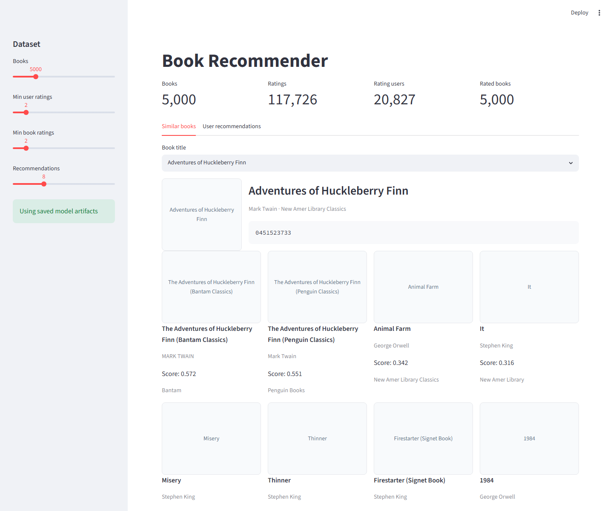

# Book Recommender System

Project ini adalah perapihan ulang dari notebook rekomendasi buku lama menjadi
project machine learning yang bisa dijalankan ulang secara lokal. Fokus project:

- memproses Kaggle Book Recommendation Dataset dari file mentah
- membuat rekomendasi buku berbasis metadata buku
- membuat rekomendasi buku berbasis histori rating user
- menyediakan notebook end-to-end dan demo Streamlit

File lama `rekomendasi.ipynb`, `rekomendasi.py`, dan zip proyek lama disimpan di
folder [`legacy/`](legacy/) sebagai arsip. Laporan lama dari README sebelumnya dipindahkan ke
[`docs/LEGACY_REPORT_2023.md`](docs/LEGACY_REPORT_2023.md).

## Tech Stack

- Python 3.10 sampai 3.12
- uv untuk virtual environment dan dependency management
- pandas, numpy, scipy, scikit-learn
- Streamlit untuk demo app
- pytest dan ruff untuk verifikasi

## Struktur Project

```text
.
|-- app/
|   `-- streamlit_app.py
|-- data/
|   |-- raw/
|   `-- processed/
|-- docs/
|   |-- DATASET.md
|   `-- LEGACY_REPORT_2023.md
|-- legacy/
|   |-- rekomendasi.ipynb
|   |-- rekomendasi.py
|   `-- recommender system.zip
|-- models/
|-- notebooks/
|   |-- 01_end_to_end_book_recommender.ipynb
|   `-- 01_end_to_end_book_recommender.py
|-- src/
|   `-- book_recommender/
|-- tests/
|-- pyproject.toml
`-- uv.lock
```

## Setup

Buat virtual environment dan install dependency:

```bash
uv venv .venv
uv sync --dev --extra app
```

Aktifkan environment di Windows PowerShell:

```powershell
.\.venv\Scripts\Activate.ps1
```

## Dataset

Dataset yang digunakan:

https://www.kaggle.com/datasets/arashnic/book-recommendation-dataset

File yang dibutuhkan:

- `Books.csv`
- `Ratings.csv`
- `Users.csv`

Letakkan ketiga file tersebut di `data/raw/`.

Download dengan Kaggle CLI:

```bash
uv run kaggle datasets download -d arashnic/book-recommendation-dataset -p data/raw --unzip
```

Detail dataset ada di [`docs/DATASET.md`](docs/DATASET.md). Folder `data/raw/`
diabaikan oleh git agar dataset besar dan file eksternal Kaggle tidak ikut
ter-commit.

## Cara Menjalankan CLI

Cek dataset:

```bash
uv run book-rec check-data --data-dir data/raw
```

Lihat ringkasan data setelah cleaning:

```bash
uv run book-rec summary --data-dir data/raw --max-books 10000
```

Rekomendasi content-based berdasarkan judul:

```bash
uv run book-rec recommend-content --data-dir data/raw --title "Adventures of Huckleberry Finn"
```

Rekomendasi collaborative filtering berdasarkan histori user:

```bash
uv run book-rec recommend-collab --data-dir data/raw --user-id 5709
```

Evaluasi ranking collaborative filtering:

```bash
uv run book-rec evaluate-collab --data-dir data/raw --sample-users 100 --k 50
```

Command evaluasi memakai split leave-one-out, lalu membandingkan collaborative
filtering dengan popularity baseline pada holdout user yang sama.

Simpan model artifact untuk setting default app:

```bash
uv run book-rec train-content --data-dir data/raw --output models/content.joblib
uv run book-rec train-collab --data-dir data/raw --output models/collab.joblib
```

Artifact di folder `models/` diabaikan oleh git. Streamlit app akan memakai
artifact tersebut jika tersedia dan setting sidebar masih default.

## Demo Streamlit

Jalankan app:

```bash
uv run streamlit run app/streamlit_app.py
```

Lalu buka:

```text
http://localhost:8501
```

Fitur app:

- pilih judul buku dan lihat rekomendasi buku serupa
- masukkan `user_id` dan lihat rekomendasi dari histori rating
- tampilkan cover buku dari URL dataset
- atur ukuran sample dan jumlah rekomendasi dari sidebar

Preview:



## Notebook End-to-End

Notebook utama:

```text
notebooks/01_end_to_end_book_recommender.ipynb
```

Notebook ini memperlihatkan alur dari awal sampai akhir:

- data understanding
- missing value dan distribusi rating
- preprocessing
- content-based recommendation
- collaborative filtering
- evaluasi Top-K sederhana
- kesimpulan dan keterbatasan

File Jupytext pasangan notebook:

```text
notebooks/01_end_to_end_book_recommender.py
```

Generate ulang notebook beserta output:

```bash
uv run jupytext --to ipynb --execute notebooks/01_end_to_end_book_recommender.py
```

## Pendekatan Model

### Content-Based Recommendation

Model content-based memakai metadata:

```text
book_title + book_author + publisher
```

Metadata diubah menjadi TF-IDF vector, lalu rekomendasi dicari dengan cosine
nearest neighbors. Pendekatan ini cocok ketika user belum punya histori rating
dan hanya tersedia buku referensi.

### Collaborative Filtering

Model collaborative filtering memakai sparse item-user matrix dari rating
eksplisit. Rating `0` dibuang karena diperlakukan sebagai belum memberi rating.
Model mencari buku dengan pola rating yang mirip, lalu merekomendasikan buku
yang mirip dengan buku-buku yang disukai user.

Pendekatan ini sengaja dibuat sebagai baseline ringan berbasis scikit-learn,
bukan deep learning. Versi notebook lama memakai TensorFlow, tetapi script lama
masih terikat Colab dan mengandung bug dot product pada model embedding. Pipeline
baru mengutamakan reproducibility dan baseline yang mudah diuji.

## Evaluasi

Notebook dan CLI memakai evaluasi leave-one-out untuk collaborative filtering:

- pilih beberapa user dengan minimal jumlah rating tertentu
- tahan satu buku dengan rating tinggi sebagai target
- latih recommender tanpa target tersebut
- rekomendasikan Top-K buku untuk user tersebut
- bandingkan collaborative filtering dengan popularity baseline

Metrik yang tersedia:

- `Precision@K`: proporsi Top-K rekomendasi yang relevan
- `Recall@K`: proporsi item relevan yang berhasil ditemukan di Top-K
- `HitRate@K`: apakah minimal satu item relevan muncul di Top-K
- `MAP@K`: rata-rata precision pada posisi item relevan
- `NDCG@K`: kualitas urutan ranking, item relevan di posisi atas bernilai lebih

Evaluasi ini adalah benchmark ranking awal, bukan klaim performa final. Untuk
eksperimen produksi, gunakan split temporal dan jumlah user evaluasi yang lebih
besar.

## Verifikasi

Jalankan test:

```bash
uv run pytest
```

Jalankan lint:

```bash
uv run ruff check src tests app notebooks/01_end_to_end_book_recommender.py
```

Verifikasi yang sudah dilakukan pada project ini:

- `uv run pytest` berhasil
- `uv run ruff check src tests app notebooks/01_end_to_end_book_recommender.py` berhasil
- `uv run book-rec check-data --data-dir data/raw` berhasil setelah dataset diunduh
- Streamlit app berhasil berjalan di `http://localhost:8501`

## Batasan Saat Ini

- Dataset sangat sparse, sehingga collaborative filtering baseline belum optimal
  dan hasil evaluasi ranking masih perlu dibaca sebagai sinyal awal.
- Rekomendasi collaborative filtering cenderung terpengaruh popularity bias:
  buku yang sering dirating lebih mudah muncul dibanding buku niche atau buku
  dengan sedikit interaksi.
- Cold-start belum diselesaikan penuh. User baru tanpa histori rating memakai
  popularity fallback, sedangkan buku baru tanpa rating sulit direkomendasikan
  oleh collaborative filtering.
- Content-based recommendation dan collaborative filtering masih berjalan sebagai
  dua pendekatan terpisah. Proyek ini belum membangun model hybrid yang
  menggabungkan metadata buku dan histori rating dalam satu skor rekomendasi.
- Fitur demografis seperti `age` dan `location` dibersihkan untuk eksplorasi,
  tetapi belum dipakai dalam model agar baseline tetap sederhana dan mudah
  direproduksi.
- Evaluasi ranking masih memakai leave-one-out pada sampel user, belum memakai
  split temporal yang lebih dekat dengan skenario produksi.
- Cover buku berasal dari URL eksternal dataset dan bisa gagal tampil jika URL
  sumber tidak tersedia.
- Streamlit app membangun model saat startup dan menyimpan hasilnya di cache jika
  artifact default di `models/` belum tersedia.

## Roadmap

- eksperimen hybrid recommender yang menggabungkan metadata dan rating
- evaluasi temporal dan sampel user yang lebih besar untuk metrik ranking
- eksplorasi mitigasi popularity bias dan strategi cold-start
- revisi atau ringkas notebook lama jika masih ingin disimpan di repo
